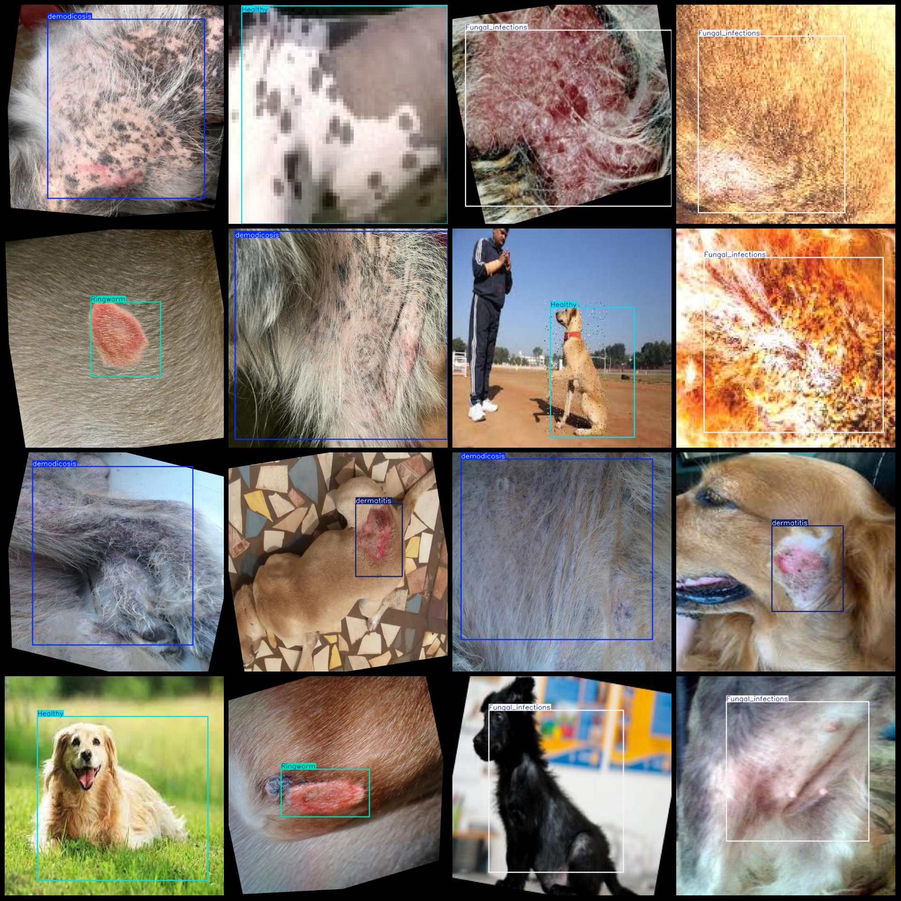

# Pet Dog Skin Disease Detection Dataset in VOC+YOLO format, 2973 images, 6 categories

Please note that some images in the dataset have been enhanced, mainly rotation enhancement.
Dataset format: Pascal VOC format + YOLO format (excluding the split path's txtfile, only containing jpg image and corresponding VOC format xmlfile and yolo format txtfile).
number of images: 2973  
annotation count: 2973  
annotation count: 2973  
annotationnumber of classes: 6  
annotation class names: ["Fungal_infections", "Healthy", "Hypersensitivity", "Ringworm", "demodicosis", "dermatitis"]
boxes per class:   
Fungal infections are a type of infection caused by fungi, which can affect various organs in the body. There are many different types of fungi that can cause infections, including molds, yeasts, and algae. Common symptoms of fungal infections include redness, swelling, pain, and fever. Treatment for fungal infections typically involves antifungal medication, such as itraconazole or fluconazole. It is important to seek medical attention if you suspect you have a fungal infection.
Healthybox count = 496
The hypersensitivity box count is 210.
The number of fungal spores found on a skin sample is measured using the Box Count method. The result is expressed as a percentage. In this case, the box count for ringworm (tinea capitis) is 834%. This means that there are more than 800 spores per milliliter of the sample.
Demodicosis (Demodex mites) is a skin condition caused by the infestation of mites such as the demodectic mite. The number of mites found on your skin, or "box count", is an indication of how many mites you have and how severe the condition is. A higher box count indicates more mites and a more severe condition.
Dermatitis is a skin condition characterized by inflammation and itching. The number 559 in the box count indicates that there are 559 individual cases of dermatitis recorded in your database.
total boxes: 3037  
images per class:   
Fungal_infections = 349  
Healthy = 491  
Hypersensitivity = 209  
Ringworm = 791  
demodicosis = 588  
dermatitis = 545
image resolution: 640x640  
Use annotation tool: labelImg
Annotation rules: Draw a rectangle around the class.
Important notes: The dataset does not have separate training, validation, and test sets. You need to manually divide them.
Special statement: This dataset does not guarantee the accuracy of the trained model or weight file.
Image preview:
## Images

Here is a pay link on Stripe ( https://buy.stripe.com/3cs8yP7sY87d0vu9AB ). Please contact me lonlonago@foxmail.com after funding $89, and I will send you a complete data files , thank you!

